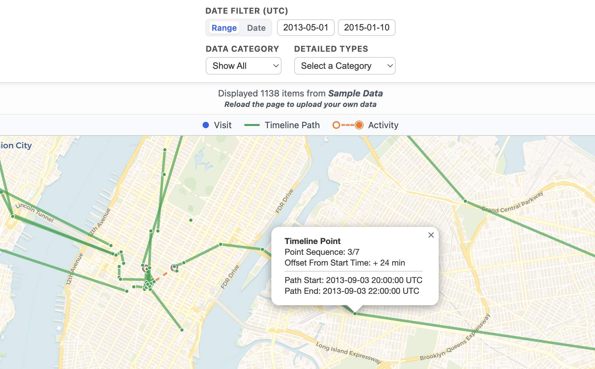
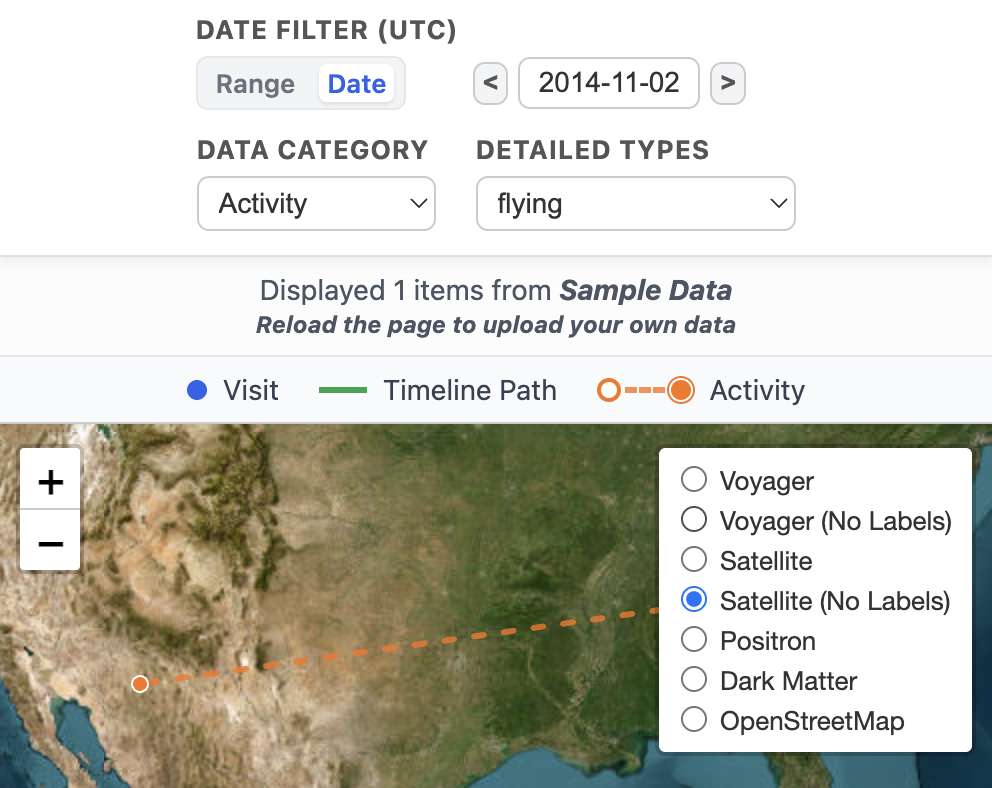

# google-maps-timeline-viewer
Mobile-Friendly Open-Source Google Maps Timeline Viewer

| File | About |
| --- | --- |
| ***index.html*** | the viewer
| ***location-history.json*** | sample data - you can upload your own in the viewer interface

## How to use:

1. Access the viewer at https://r-li.com/google-maps-timeline-viewer
 or 
Download ***index.html*** to use locally or customize it as needed.
  
2. Click **Upload Google Maps Timeline JSON** to upload the exported JSON file from Google Maps
 or 
Click **Load Sample Data** to load the sample data and give it a try. Reload the page to return to the upload interface.

## Functionalities: 
* Mobile-friendly
* Click ***lines*** or ***points*** to view details

* Filter data by ***date range*** or ***single date***
* Filter data by ***categories*** and ***detailed types***
* Change ***basemaps***

## How to export Google Maps Timeline data:

**Official Doc:** https://support.google.com/maps/answer/6258979

**Note:** Timeline is no longer available on computers

**For iPhone & iPad:**
* Open the *Google Maps* app
* Tap profile picture or initial (top right) → *Settings* → *Location & privacy* → *Export Timeline data* (under *Timeline*) → *Save to Files*
* Select your preferred storage location → *Save*

**For Android:**
* Open the device's *Settings* app
* Tap *Location* → *Location services* → *Timeline* → *Export Timeline data* (under *Timeline*) → *Continue*
* Select your preferred storage location → *Save*

## About the data:

| Category | Geo Data | For | Detailed Types |
| :-: | --- | --- | --- |
| ***visit*** | point | places visited | *Home*, *Work*, *Searched Address*, *Unkonwn*, etc. |
| ***activity*** | start point + end point | activities from one point to another | *walking*, *cycling*, *flying*, *in subway*, etc. |
| ***timelinePath*** | path - collection of all recorded points along the path | movements paths | n/a |

## Time zone:

All timestamps will be converted to Coordinated Universal Time (UTC)

## Acknowledgement:

Coded with assistance from *Google Gemini 3 Pro* and *Microsoft Copilot*
